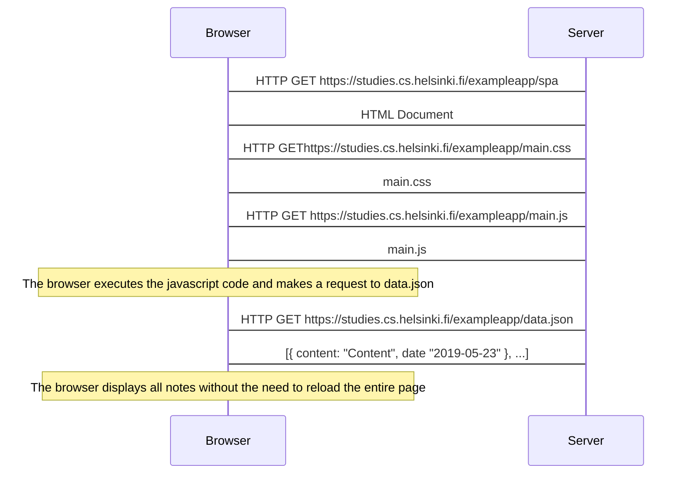

```mermaid
sequenceDiagram
Browser -> Server: HTTP GET https://studies.cs.helsinki.fi/exampleapp/spa
Server -> Browser: HTML Document
Browser -> Server: HTTP GEThttps://studies.cs.helsinki.fi/exampleapp/main.css
Server -> Browser: main.css
Browser -> Server: HTTP GET https://studies.cs.helsinki.fi/exampleapp/main.js
Server -> Browser: main.js
note over Browser: The browser executes the javascript code and makes a request to data.json
Browser -> Server: HTTP GET https://studies.cs.helsinki.fi/exampleapp/data.json
Server -> Browser: [{ content: "Content", date "2019-05-23" }, ...]
note over Browser: The browser displays all notes without the need to reload the entire page


```
